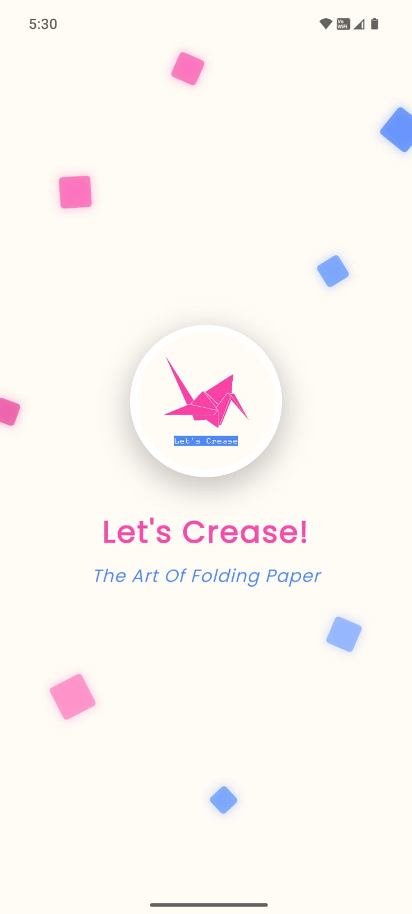
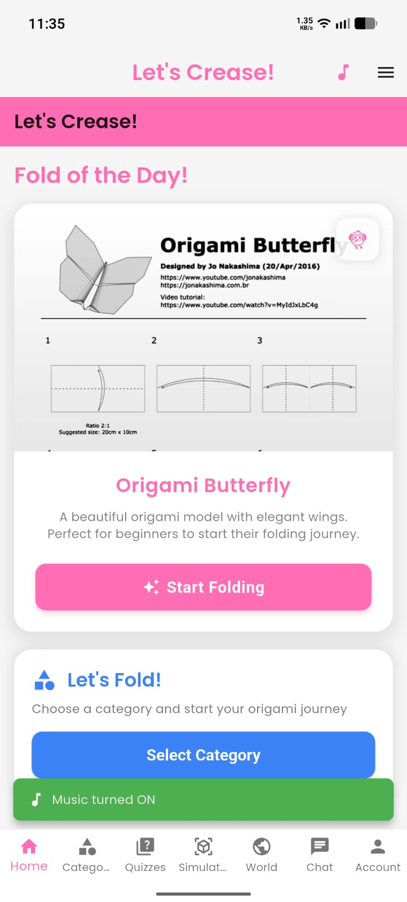
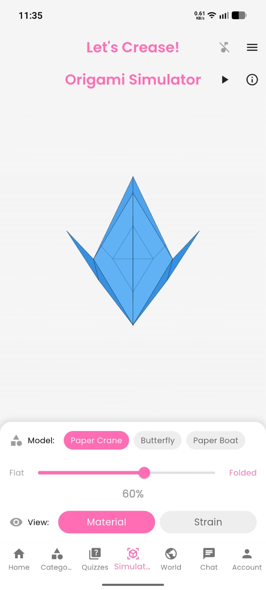
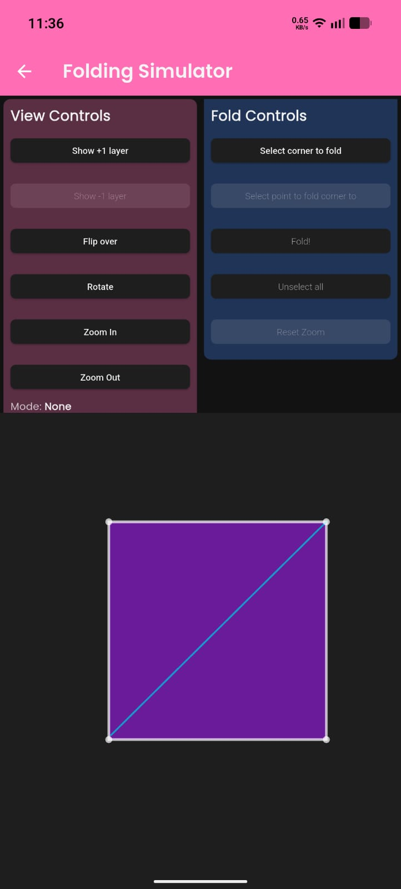

# Let's Crease! 🦢
> The Art of Folding Paper


A comprehensive origami learning app built with Flutter and Firebase, featuring authentication, skill-based learning, quizzes, and community features.
## 📱 Screenshots

<p float="left">
  
  
  
  
</p>

# Features
### 🎨 **Core Features**
- **Splash Screen**: Beautiful origami-themed intro animation
- **Firebase Authentication**: Secure email/password login and registration
- **Skill Level Selection**: Personalized experience based on user skill (Beginner/Moderate/Advanced)
- **Fold of the Day**: Daily origami model recommendations with category browsing
- **Photo Sharing**: Upload and share your origami creations
- **Quiz System**: Test knowledge across 4 categories (Artists, History, Paper, Folds)
- **Blog Section**: Learn about famous origami artists and their techniques
- **User Profile**: Track folding history, quiz scores, and manage account settings

### 🏗️ **Technical Stack**
- **Frontend**: Flutter with Material 3 design
- **Backend**: Firebase (Auth, Firestore, Storage)
- **State Management**: Riverpod
- **Navigation**: GoRouter
- **UI**: Google Fonts, Lottie animations, Cached Network Images

## Project Structure

```
lib/
├── core/
│   ├── constants/
│   │   └── app_constants.dart
│   ├── models/
│   │   ├── user_model.dart
│   │   ├── quiz_model.dart
│   │   └── blog_model.dart
│   ├── providers/
│   │   ├── auth_provider.dart
│   │   ├── user_provider.dart
│   │   └── quiz_provider.dart
│   ├── services/
│   │   ├── firebase_service.dart
│   │   ├── auth_service.dart
│   │   ├── quiz_service.dart
│   │   ├── storage_service.dart
│   │   └── blog_service.dart
│   ├── theme/
│   │   └── app_theme.dart
│   ├── router/
│   │   └── app_router.dart
│   └── widgets/
│       └── custom_page_transition.dart
├── features/
│   ├── splash/
│   │   └── splash_screen.dart
│   ├── auth/
│   │   ├── login_screen.dart
│   │   └── signup_screen.dart
│   ├── skill_selection/
│   │   └── skill_selection_screen.dart
│   ├── home/
│   │   └── home_screen.dart
│   ├── quiz/
│   │   ├── quiz_categories_screen.dart
│   │   └── quiz_screen.dart
│   ├── blog/
│   │   └── blog_screen.dart
│   └── profile/
│       └── profile_screen.dart
├── firebase_options.dart
└── main.dart
```

## Setup Instructions

### 1. Firebase Configuration
1. Create a new Firebase project at [Firebase Console](https://console.firebase.google.com/)
2. Enable Authentication (Email/Password)
3. Create Firestore database
4. Enable Storage
5. Replace the placeholder values in `lib/firebase_options.dart` with your actual Firebase configuration
6. Replace `android/app/google-services.json` with your actual Google Services file

### 2. Dependencies Installation
```bash
flutter pub get
```

### 3. Run the App
```bash
flutter run
```

## Firebase Setup Details

### Authentication
- Email/Password authentication enabled
- User profiles stored in Firestore with skill levels and history

### Firestore Collections
- `users`: User profiles with folding history and quiz scores
- `quizzes`: Quiz questions organized by category
- `blogs`: Artist profiles and origami articles
- `quiz_results`: User quiz completion records

### Storage
- `profile_images/`: User profile pictures
- `folding_images/`: User-uploaded origami photos

## App Flow

1. **Splash Screen** → Authentication check
2. **Login/Signup** → User authentication
3. **Skill Selection** → First-time user setup
4. **Home Screen** → Main dashboard with categories and photo upload
5. **Quiz System** → Knowledge testing with scoring
6. **Blog Section** → Educational content about artists
7. **Profile** → User management and history

## Key Features Implementation

### State Management (Riverpod)
- `AuthProvider`: Manages authentication state
- `UserProvider`: Handles user profile data
- `QuizProvider`: Controls quiz state and scoring

### Navigation (GoRouter)
- Route protection based on authentication state
- Smooth transitions between screens
- Deep linking support

### UI/UX
- Material 3 design system
- Origami-inspired color palette (pastels)
- Responsive design for different screen sizes
- Loading states and error handling

## Development Notes

- The app uses sample quiz data stored locally
- Blog content is currently static but can be easily connected to Firestore
- Image upload functionality is fully implemented with Firebase Storage
- All Firebase operations include proper error handling

## Next Steps for Production

1. Add actual Firebase project configuration
2. Populate Firestore with real quiz questions and blog content
3. Implement push notifications for daily fold reminders
4. Add social features (sharing, comments)
5. Implement offline support with local caching
